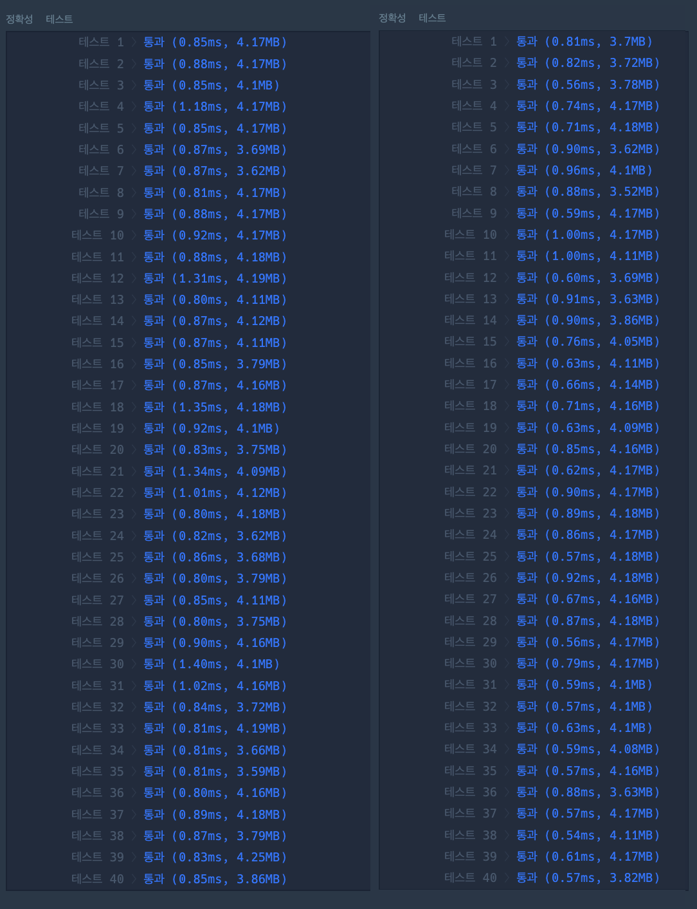
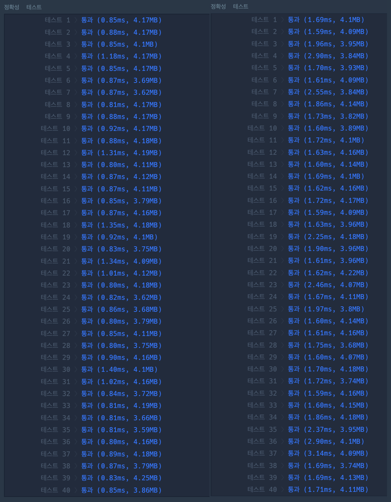

# 프로그래머스 모음사전, C++

[Link](https://school.programmers.co.kr/learn/courses/30/lessons/84512)

## 문제 요약
알파벳 aeiou 로 만들어지는 단어에 대한 사전순 위치 구하기

## 접근
### 1.  완전탐색
생각없이 완전탐색으로 구현했다.
모든 값을 구해서 map에 저장한다.
for문으로 구현하는데 실패해서 재귀함수를 사용했다.
```c++
void make(int ind, string word)
{
    if (ind == 6)
    {
        return;
    }
    if (word != "" && !dict.count(word)) 
    {
	    // dict[word] = index++; 아래 두줄을 하나로 합쳐도 된다.
        dict[word] = index;
        index++;
    }
    for (int i=0; i<5; i++)
    {
        make(ind+1, word+base[i]);
    }

    return ;
}

```


## 전체 코드
```c++
#include <string>
#include <vector>
#include <unordered_map>

using namespace std;

unordered_map<string, int> dict;
string base = "AEIOU";
int index = 1;
void make(int ind, string word)
{
    if (ind == 6)
    {
        return;
    }
    if (word != "" && !dict.count(word)) 
    {
        dict[word] = index;
        index++;
    }
    for (int i=0; i<5; i++)
    {
        make(ind+1, word+base[i]);
    }

    return ;
}

int solution(string word) {
    make(0, "");
    
    return dict[word];
}
```

## 한번 볼만한 것
1. 재귀함수 vs 반복문
```c++
#include <string>
#include <vector>
#include <unordered_map>
#include <iostream> // cout

using namespace std;

unordered_map<string, int> dict;
string base = "AEIOU";
int index = 1;
void make()
{
    string word = "";
    for (int i=0; i<5; i++)
    {
        string tmpi = word;
        word += base[i];
        dict[word] = index++;
        for (int j=0; j<5; j++)
        {
            string tmpj = word;
            word += base[j];
            dict[word] = index++;
            for (int k=0; k<5; k++)
            {
                string tmpk = word;
                word += base[k];
                dict[word] = index++;
                for (int l=0; l<5; l++)
                {
                    string tmpl = word;
                    word += base[l];
                    dict[word] = index++;
                    for (int m=0; m<5; m++)
                    {
                        string tmpm = word;
                        word += base[m];
                        dict[word] = index++;
                        word = tmpm;
                    }
                    word = tmpl;
                }
                word = tmpk;
            }
            word = tmpj;
        }
        word = tmpi;
    }
    return;
}

int solution(string word) {
    make();
    
    return dict[word];
}
```

왼쪽 재귀함수 오른쪽 반복문
들쭉날쭉하긴한데 오른쪽이 평균적으로 적게 걸림


2. unordered_map(좌) vs map(우)
트리를 사용한게 시간이 늘수밖에 없음
 

